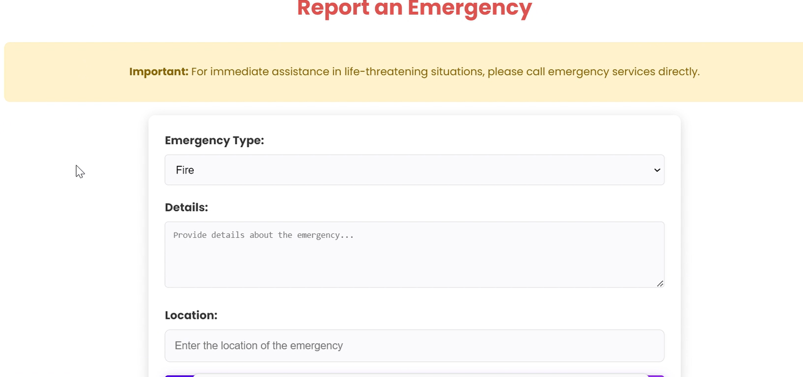
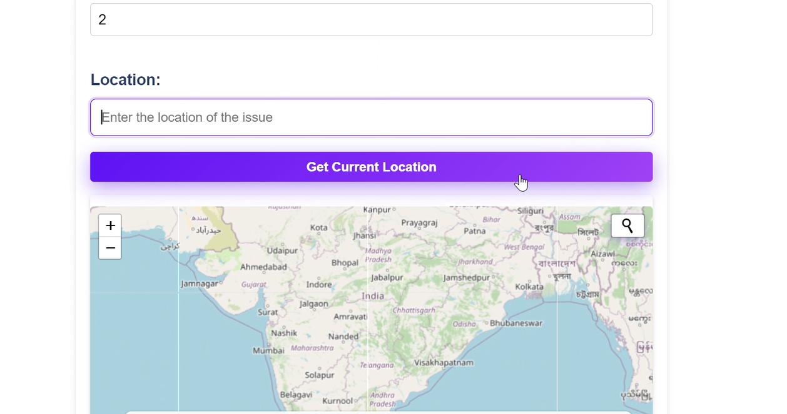
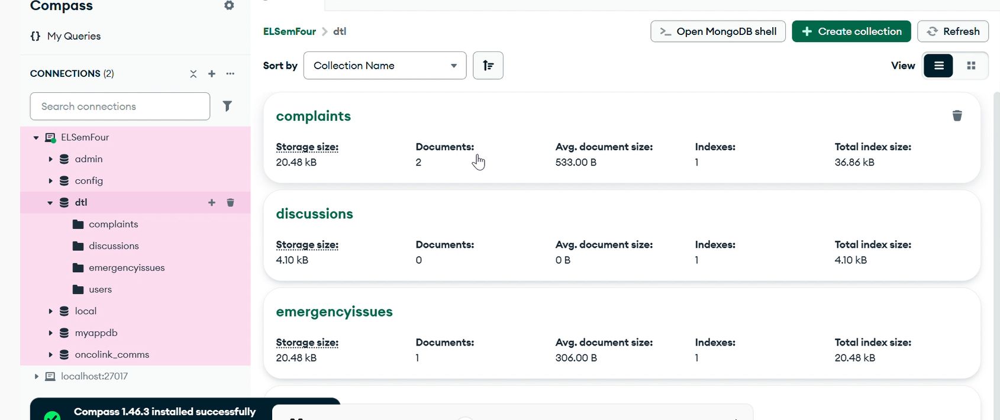

# Pothole Reporting Portal

[](https://youtu.be/pxCCh2N8sJ0)

Watch this video to see it work!


SIMPLY RUN NODE APP.JS TO START THE APPLICATION.
A web application for citizens to report civic issues, and for authorities to manage and track these reports. The system includes an emergency reporting feature and a community discussion forum.

> **Note:** The entire frontend (all EJS templates and UI) was created using agentic coding tools within an hour.

## Tech Stack

### Backend
- **Node.js** - JavaScript runtime environment
- **Express.js** - Web application framework for Node.js
- **MongoDB** - NoSQL database for storing application data
- **Mongoose** - MongoDB object modeling tool for Node.js

### Frontend
- **EJS (Embedded JavaScript)** - Templating engine for generating HTML markup
- **EJS-Mate** - Layout support for EJS templates
- **HTML/CSS** - Structure and styling
- **Bootstrap** (implied from view templates) - CSS framework for responsive design

> The entire frontend was made by using agentic coding tools within an hour.

### Authentication & Security
- **Bcrypt** - Password hashing library for secure user authentication
- **Express-Session** - Session middleware for Express.js

### File Handling
- **Multer** - Middleware for handling multipart/form-data (file uploads)

## Core Functionalities

### Citizen Features
1. **Report Issues** - Submit complaints about potholes and civic issues
   <br>
2. **Upload Images** - Attach photos to issue reports
   <br>
3. **Emergency Reporting** - Quick reporting for critical issues
   <br>
4. **Track Status** - Monitor progress on reported issues
   <br>
5. **Discussion Forum** - Community platform to discuss civic issues
   <br>
6. **Map Overview** - Visualize issues on a map
   <br>

### Authority Features
1. **Manage Reports** - View and handle incoming complaints
   <br>
2. **Update Status** - Change the status of reports (e.g., "In Progress", "Resolved")
   <br>
3. **Filter Reports** - Filter issues by type
   <br>
4. **User Authentication** - Secure login for authorized personnel
   <br>
5. **Landing Page** - Entry point for citizens and authorities
   <br>
6. **Database** - MongoDB database for all civic issues
   <br>

> All frontend features and UI were rapidly developed using agentic coding tools.

## Project Structure

- `/models` - Database schemas (User, Complaints, EmergencyIssue, Forum)
- `/views` - EJS templates for rendering pages
- `/public` - Static assets (CSS, images)
- `/routes` - API routes configuration
- `/middleware` - Custom middleware functions
- `/uploads` - Storage for uploaded images
- `app.js` - Main application file

## Installation & Setup

### Prerequisites
- Node.js (v12 or higher)
- MongoDB (v4 or higher)

### Installation Steps
1. Clone the repository:
   ```
   git clone [repository-url]
   cd Pothole
   ```

2. Install dependencies:
   ```
   npm install
   ```

3. Configure MongoDB:
   - Ensure MongoDB is running on your system
   - The application connects to `mongodb://127.0.0.1:27017/dtl` by default
   - You can modify the connection string in `app.js` if needed

4. Start the application:
   ```
   node app.js
   ```

5. Access the application:
   - Open your browser and navigate to `http://localhost:3000`

## Usage Guide

### For Citizens
1. Visit the landing page and select "Citizen"
2. From the citizen dashboard, you can:
   - View existing reports
   - Add a new complaint (with details and optional image)
   - Report emergency issues
   - Access the discussion forum

### For Authorities
1. Visit the landing page and select "Authority"
2. Log in with your credentials
3. From the authority dashboard, you can:
   - View all citizen reports
   - Filter reports by type
   - Update the status of reports
   - Manage emergency issues

## Development Guide

### Adding New Features
1. Create appropriate models in the `/models` directory
2. Add routes in `app.js` or create new route files in `/routes`
3. Create view templates in the `/views` directory
4. Update existing views to link to new features

### Modifying the Database
1. Update schemas in the `/models` directory
2. If changing existing schemas, ensure backward compatibility

## Customization

You can customize the application by:
1. Modifying CSS styles in `/public/style.css`
2. Updating EJS templates in the `/views` directory
3. Adding new issue types in the complaint submission form

